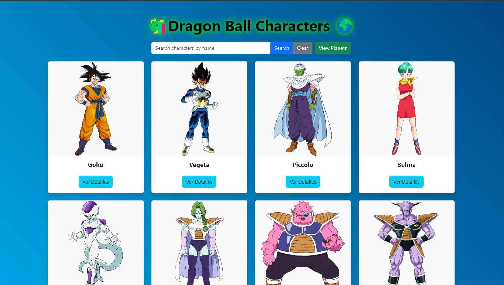

# Dragon Ball Project API Dragon Ball Z en React

Este proyecto muestra información sobre los personajes y planetas del universo Dragon Ball. Está diseñado con React (HTML, CSS y JavaScript) utilizando Bootstrap para el estilo y la funcionalidad de los modales y paginación.

## API de Dragon Ball

El proyecto utiliza la Dragon Ball API, una API pública que proporciona datos detallados sobre personajes, planetas, y más del universo Dragon Ball. Esta API es una excelente herramienta para acceder a información rica y variada, lo que permite integrar contenido relevante y actualizado en tus aplicaciones y proyectos.

### Recursos Disponibles en la API

La API de Dragon Ball ofrece los siguientes recursos:

- **Personajes**: Información sobre los personajes principales y secundarios, incluyendo detalles como nombre, imagen, descripción, y atributos específicos.
- **Planetas**: Datos sobre los planetas del universo Dragon Ball, con información visual y descriptiva.
- **Otras Entidades**: Dependiendo de la versión de la API, también puede ofrecer información sobre otras entidades relevantes.

### Documentación

Puedes consultar la documentación completa de la API en [Dragon Ball API Documentation](https://dragon-ball-api.com/documentation) para obtener detalles sobre los endpoints disponibles, ejemplos de uso, y parámetros necesarios para realizar solicitudes.

## Creación del Proyecto

Crea un nuevo proyecto de React utilizando Create React App:

```

cd %userprofile%\Desktop

npx create-react-app dragon-ball-project

Asegúrate de tener react-router-dom instalado:

npm install react-router-dom
```


Reemplaza el contenido generado automáticamente con los archivos y código proporcionado.

## Estructura del Proyecto

El proyecto tendrá la siguiente estructura:

```
dragon-ball-project
│
├── public
│   └── index.html
├── src
│   ├── components
│   │   ├── CharacterCard.js
│   │   ├── CharacterModal.js
│   │   ├── PlanetCard.js
│   │   ├── PlanetModal.js
│   │   └── Pagination.js
│   ├── pages
│   │   ├── Characters.js
│   │   └── Planets.js
│   ├── App.js
│   ├── index.js
│   └── styles.css
└── package.json
```

## URL del Proyecto Desplegado:

https://dragon-ball-project-react.vercel.app/


## Galería

| Imagen 1 | Imagen 2 | Imagen 3 |
|:---------:|:---------:|:---------:|
|  |  |  |
| Portada 1 | Portada 2 | Portada 3 |

| Imagen 4 | Imagen 5 | Imagen 6 |
|:---------:|:---------:|:---------:|
|  |  |  |
| Portada 4 | Portada 5 | Portada 6 |


## Scripts Disponibles

En el directorio del proyecto, puedes ejecutar:

### `npm start`

Ejecuta la aplicación en modo de desarrollo.
Abre [http://localhost:3000](http://localhost:3000) para verla en tu navegador.

La página se recargará cuando hagas cambios.
También puedes ver errores de lint en la consola.

### `npm test`

Inicia el ejecutor de pruebas en modo interactivo.
Consulta la sección sobre [ejecutar pruebas](https://facebook.github.io/create-react-app/docs/running-tests) para más información.

### `npm run build`

Construye la aplicación para producción en la carpeta `build`.
Empaqueta React correctamente en modo de producción y optimiza la construcción para obtener el mejor rendimiento.

La construcción se minifica y los nombres de archivo incluyen los hashes.
¡Tu aplicación está lista para ser desplegada!

Consulta la sección sobre [despliegue](https://facebook.github.io/create-react-app/docs/deployment) para más información.

### `npm run eject`

**Nota: esta es una operación de un solo sentido. Una vez que 'ejectas', ¡no puedes volver atrás!**

Si no estás satisfecho con la herramienta de construcción y las opciones de configuración, puedes 'eyectar' en cualquier momento. Este comando removerá la única dependencia de construcción de tu proyecto.

En su lugar, copiará todos los archivos de configuración y las dependencias transitivas (webpack, Babel, ESLint, etc.) directamente en tu proyecto para que tengas control total sobre ellos. Todos los comandos excepto `eject` seguirán funcionando, pero apuntarán a los scripts copiados para que puedas ajustarlos. En este punto, estás por tu cuenta.

No tienes que usar `eject` nunca. El conjunto de funciones seleccionadas es adecuado para despliegues pequeños y medianos, y no deberías sentirte obligado a usar esta función. Sin embargo, entendemos que esta herramienta no sería útil si no pudieras personalizarla cuando estés listo para ello.

## Aprende Más

Puedes aprender más en la [documentación de Create React App](https://facebook.github.io/create-react-app/docs/getting-started).

Para aprender React, consulta la [documentación de React](https://reactjs.org/).

### División del Código

Esta sección se ha movido aquí: [https://facebook.github.io/create-react-app/docs/code-splitting](https://facebook.github.io/create-react-app/docs/code-splitting)

### Analizando el Tamaño del Paquete

Esta sección se ha movido aquí: [https://facebook.github.io/create-react-app/docs/analyzing-the-bundle-size](https://facebook.github.io/create-react-app/docs/analyzing-the-bundle-size)

### Creando una Aplicación Web Progresiva

Esta sección se ha movido aquí: [https://facebook.github.io/create-react-app/docs/making-a-progressive-web-app](https://facebook.github.io/create-react-app/docs/making-a-progressive-web-app)

### Configuración Avanzada

Esta sección se ha movido aquí: [https://facebook.github.io/create-react-app/docs/advanced-configuration](https://facebook.github.io/create-react-app/docs/advanced-configuration)

### Despliegue

Esta sección se ha movido aquí: [https://facebook.github.io/create-react-app/docs/deployment](https://facebook.github.io/create-react-app/docs/deployment)

### `npm run build` falla al minificar

Esta sección se ha movido aquí: [https://facebook.github.io/create-react-app/docs/troubleshooting#npm-run-build-fails-to-minify](https://facebook.github.io/create-react-app/docs/troubleshooting#npm-run-build-fails-to-minify)
